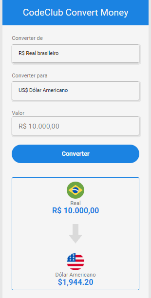

# Conversor de moedas

> Projeto finalizado 
 

## 💻 Sobre o Projeto

Este projeto trata-se de um conversor de moedas totalmente funcional. O projeto consume uma <a href="https://docs.awesomeapi.com.br/api-de-moedas">API</a> da cotação das moedas atualizada a cada 30 segundos.

 

## 👨‍💻Link para acesso: 
<a href="https://mathjuve.github.io/Conversor-de-moedas/">Aperte aqui ⬅ </a>

## ☕ tecnologias utilizadas

 

## 💙 Colaborador

<table>
  <tr>
    <td align="center">
      <a href="#">
         
        
          <a >Matheus Juvenal</a>
        
      </a>
    </td>
  </tr>
</table>

  

 

[⬆ Voltar ao topo](#Conversor-de-moedas) 
